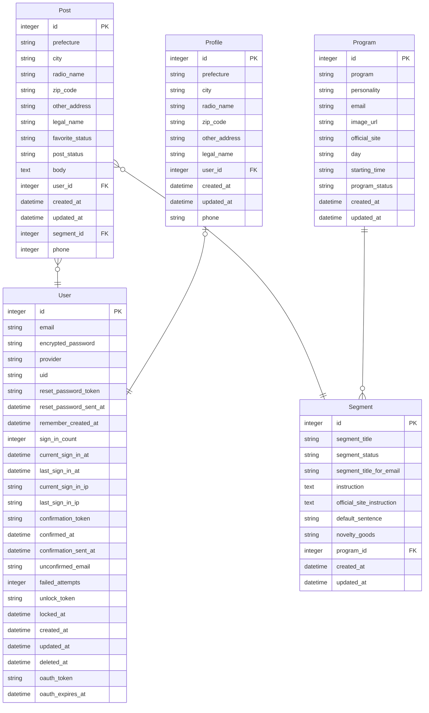

## 🎙 YONDE 📮

<!-- テスト作成後、下記を追加
 -->

オールナイトニッポン（以下、ANN）の番組・コーナーを選びネタを書くだけで、  
番組指定の投稿方法通りの投稿メールが作れます。  
※本アプリはニッポン放送非公式です。
 
 

## 🎙 URL 📮
https://yonde.fly.dev/
 
<!-- リリース後追加
🎧 PV数：0PV  
🎧 ユーザー登録数：0人  
(2023年10月1日現在) -->
 
 

## 🎙 アプリに込めた思い 📮
ANNを含め、ラジオを聞き続けて20数年。

古くより「ラジオの華はリスナーの投稿にあり」とはよく言いますが、  
各番組に必ずいるのが番組内で何度も投稿を読み上げられる常連リスナー、  
もとい、ハガキ職人です。

また、番組が改変され新パーソナリティとなった場合、  
そのファンが「初めての投稿」を行うこともあるでしょう。

番組への投稿を頻繁に行うリスナーにとっては、  
投稿の下書きをまとめておけるファイルのようなサービスとして。  
  
初めて投稿するリスナーにとっては、投稿への第一歩を踏み出す  
手助けができるようなサービスとして。  

このアプリを通して番組への投稿を1通でも増やせたら、嬉しいです。
 
 

## 🎙 ANNへの投稿に対する課題 📮
### ユーザーが抱える問題
* 各番組のネタ投稿コーナーごとに、「メールにはこのように書いてください」といった指示がある
  * 例）読み上げられるコーナー名は「あたしゃぁ～」だが、メールの件名は「あたしゃ」にしなければならない
* Googleフォームのようなフォームがないので、メールを作成して、番組に送信する必要がある
* メールに名前（or ラジオネーム）や件名を毎回コピペして送らないといけない
* せっかく投稿しているのに、番組からの指示と異なっているため、採用されない場合がある

-> **これらにより、投稿・採用へのハードルが高くなっていると予想**
### 解決方法
* 目的：ユーザーの投稿のハードルを下げること  
* 機能：フォームにしたがって内容を記載するだけで、番組の指示にしたがったメールが作れる機能を実装
  * コーナー名は選択式にする（選択すると番組の指示にしたがった件名が入る）
  * ラジオネームや都道府県などの毎回記載する内容を登録できる機能
  * デフォルトを登録できる機能で、投稿内容作成時には自動入力されている
 
 

## 🎙 執筆記事 📮
執筆中
 

<!-- あとで修正する  
🎧 View：0000PV  
(2023年10月1日現在) -->
 
 

## 🎙 使用技術 📮
#### バックエンド
* Ruby 3.0.3
* Rails 7.0.6

#### フロントエンド
* HTML
* CSS（SCSS）
* Bootstrap 5.3.1（フレームワーク）
* JavaScript（Stimulus）

#### データベース
* Postgres
#### デプロイ先
* fly.io

<!-- あとで修正する
## 🎙 テスト 📮
- RSpec
  - 単体テスト(model)
  - 機能テスト(request)
  - 統合テスト(feature) -->
 
 

## 🎙 主なページと機能 📮
<!-- あとで書く
- ユーザー登録、ログイン機能(devise)
- 投稿機能
  - 画像投稿(refile)
  - 位置情報検索機能(geocoder)
- いいね機能(Ajax)
  - ランキング機能
- コメント機能(Ajax)
- フォロー機能(Ajax)
- ページネーション機能(kaminari)
  - 無限スクロール(Ajax)
- 検索機能(ransack)
- * ユーザー特定機能(LINE API、fetch)
* スケジュール作成、更新機能(LIFF、ajax)
* ミッション通知機能(whenever、messaging API)
* ミッション完了/未完了機能(ajax)
* LINE応答機能(messaging API) -->
 
 

## 🎙 画面遷移図 📮
https://www.figma.com/file/EJ5mZWpMUNK245rYMpHpAL/ScreenFlowDiagram?type=design&node-id=509%3A2609&mode=design&t=EszcWVn95hzmmMAA-1
 
 

## 🎙 ER図 📮

 
 

## 🎙 今後のアップデート（予定） 📮
* 目的：ユーザーがより採用されやすくなる投稿メールを作れるようになること
* 機能：投稿内容の壁打ちできる機能を実装
  * ChatGPTなどのLLMモデルサービスを用いて、投稿内容の相談相手になってもらう機能
    * 暴力的な差別的な表現があれば、言い換え案を提案してくれる
  * 下記のような採用されるコツが投稿作成時に表示される
    * 「書き言葉」ではなく「話し言葉」であること
    * トークが展開するような投稿であること
    * 1メールにつき話題は1つまで
