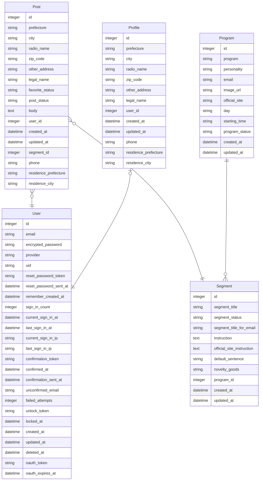

## 🎙 YONDE | Write and Submit Emails to the All Night Nippon Radio Program 📮

[Japanese](https://github.com/morihagi/yonde_develop/blob/develop/README_JP.md)

Welcome to YONDE! This app allows you to send messages to your favorite All Night Nippon radio programs and segments. It's a simple process—just select your preferred program and segment, compose your email, and submit it following the specific guidelines of the program. Please note that this app is not officially affiliated with the Nippon Broadcasting System.

 
 

## 🎙 URL 📮
https://yonde.fly.dev/
 
<!-- After release
🎧 PV count：0PV  
🎧 User registration count：0 people  
(as of October 1, 2023) -->
Sign up for a guest user
Email: example@sample.com
Password: password12
 
 

## 🎙 Thoughts behind This App 📮
Having been a dedicated radio listener for over two decades, I believe that the heart of radio programs often lies within the listener's emails. Every program has its loyal listeners, and their emails are frequently read out on air. However, when a program goes through changes or introduces a new host, fans might find themselves submitting their "first email."

For both seasoned contributors and first-time submitters, YONDE offers a solution. It serves as a filing system for organizing email drafts and provides guidance to newcomers. My hope is that this app can increase the number of listener email submissions, which in turn, brings in more engagement to these programs.

 
 

## 🎙 Challenges for Listeners Submitting to ANN 📮
Here are some of the challenges listeners face when submitting their emails to ANN:

- Specific program instructions:
  - Each program's email submission segment comes with specific instructions, like "Please include XYZ in your email."
  - For instance, the segment name announced might be "Confession Room of Degradation! No Longer Human!" on the program, but the subject line of the email must be "No Longer Human."
 

- Manual email creation:
  - The radio station's website lacks an automated email submission system, so listeners must manually create and send emails.
 

- Repeated copying and pasting:
  - Listeners must copy and paste their names (or nicknames) and the subject in their email every time.
 

- Risk of submission deviations:
  - Any deviations from the program's submission instructions may result in rejection.

**These challenges often make the submission process complex while increasing the risk of emails being rejected.**

### Proposed Solution
Objective: Simplify the email submission process for listeners.

Functionality:
  - Segment Selection: YONDE empowers users to compose emails in line with program guidelines by completing a simple form. It allows users to choose the segment name, which then automatically populates the subject line, thus ensuring compliance with program guidelines.

  - Content Templates: The app enables users to save frequently used content, such as radio names and prefectures, hence streamlining the submission process and reducing repetition.

  - Default Information: YONDE offers a feature to record default information that will be automatically included in every email submission. This ensures consistency and adherence to program instructions.

**With these features, our aim is to make email submissions to All Night Nippon radio programs a breeze, whether you're a long-time contributor or a first-time sender.**

 
 

## 🎙 Blog 📮
In progress
 

<!-- Correct later  
🎧 View：0000PV  
(as of October 1, 2023) -->
 
 

## 🎙 Technologies used 📮
#### Backend
* Ruby 3.0.3
* Rails 7.0.6

#### Frontend
* HTML (Slim)
* CSS (SCSS)
* Node.js 15.14.0
* Bootstrap 5.3.1 (Framework)
* JavaScript (Stimulus)

#### Database
* Postgres
#### Deployment destination
* fly.io
 
 

## 🎙 Testing 📮
- RSpec
  - Mdel test
  - Request test
  - System test
 
 

## 🎙 Main pages and functions 📮
In progress
<!-- Write later
- User registration, login function (devise)
- Posting function
  - Image posting (refile)
  - Location information search function (geocoder)
- Like function (Ajax)
  - Ranking function
- Comment function (Ajax)
- Follow function (Ajax)
- Pagination function (kaminari)
  - Infinite scroll (Ajax)
- Search function (ransack)
- * User identification function (LINE API, fetch)
* Schedule creation, update function (LIFF, ajax)
* Mission notification function (whenever, messaging API)
* Mission completion/incompletion function (ajax)
* LINE response function (messaging API) -->
 
 

## 🎙 Screen transition diagram 📮
[Go to Figma](https://www.figma.com/file/EJ5mZWpMUNK245rYMpHpAL/ScreenFlowDiagram?type=design&node-id=509%3A2609&mode=design&t=EszcWVn95hzmmMAA-1)
 
 

## 🎙 ER diagram 📮

 
 

🎙 Planned Future Updates 📮
- Objective: Enhance the ability of listers to craft submission emails that have a higher likelihood of acceptance.
- Functionality: Develop a feature that enables listers to refine their submission content.
  - Introduce a feature that leverages LLM model services, such as ChatGPT, to act as a consultation partner for refining submission content.
    - If the content contains violent or discriminatory language, the system will suggest alternative phrasing.
  - When creating a submission, tips for increasing the chances of acceptance are displayed, such as:
    - Favor “conversational language” over “formal written language”.
    - Ensure the submission encourages further discussion.
    - Restrict the email to a single topic.
