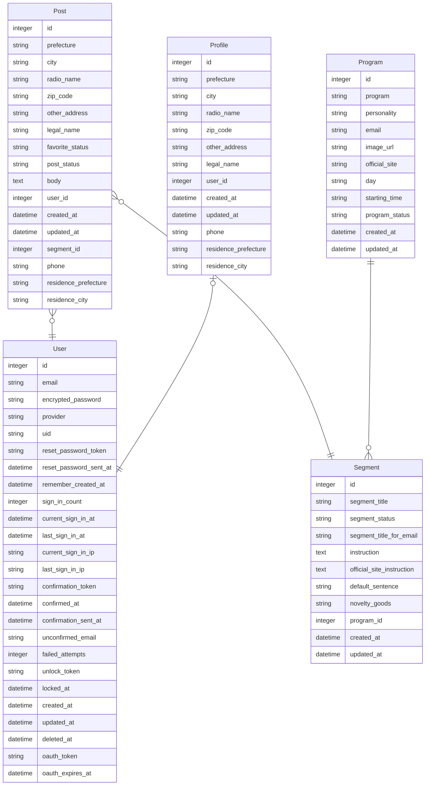

## 🎙 YONDE | Generate Emails for the Radio Program, All Night Nippon 📮

[Japanese](https://github.com/morihagi/yonde_develop/blob/develop/README_JP.md)

By choosing a program and segment of All Night Nippon (ANN), and composing a message, you can generate an email in accordance with the program’s specific guidelines. Please note, this app is not officially affiliated with the Nippon Broadcasting System.

 
 

## 🎙 URL 📮
https://yonde.fly.dev/
 
<!-- After release
🎧 PV count：0PV  
🎧 User registration count：0 people  
(as of October 1, 2023) -->
 
 

## 🎙 Thoughts put into the app 📮
I've been a dedicated radio listener, including ANN, for over two decades. It's often stated that "the essence of radio lies within the listener's emails." Every program has its loyal listeners whose emails are frequently read out on the show. When a program undergoes a revamp and a new host is introduced, these fans might send their "first email submission."

For listeners who regularly contribute to programs, it would be beneficial to have a service akin to a file system where they can organize their draft submissions.For those submitting for the first time, a service that can guide them in taking the initial step toward submission would be advantageous.

It would bring me great joy if this app could increase the number of submissions to the program by even one.
 
 

## 🎙 Challenges for a Listener Submitting an Email to ANN 📮
- Each program’s story submission segment comes with specific instructions, such as “Please include this in your email.”
  - For example, the segment name announced might be “Confession Room of Degradation! No Longer Human!” on the program, but the subject line of the email must read “No Longer Human.”
- There isn’t a form similar to Google Form available, so listeners need to manually create an email and send it to the program.
- Listeners must copy and paste their name (or radio name) and subject into their email every time.
- Despite taking the time to submit, if the submission deviates from the program’s instructions, it may not be selected.

--> **These factors are expected to increase the difficulty of making submissions and getting them selected.**

### Proposed Solution
- Objective: Streamline the submission process for listers.
- Function: Develop a feature that empowers listers to compose an email in accordance with the program’s guidelines by simply completing a form.
  - Facilitate listers to choose the segment name (this selection will auto-populate the subject line as dictated by the program’s guidelines).
  - Integrate a feature that permits listers to record content that is required each time, such as radio names and prefectures.
  - Embed a feature that enables listers to record default information, which will be automatically incorporated when crafting submission content.

 
 

## 🎙 Blog 📮
In progress
 

<!-- Correct later  
🎧 View：0000PV  
(as of October 1, 2023) -->
 
 

## 🎙 Technologies used 📮
#### Backend
* Ruby 3.0.3
* Rails 7.0.6

#### Frontend
* HTML
* CSS (SCSS)
* Bootstrap 5.3.1 (Framework)
* JavaScript (Stimulus)

#### Database
* Postgres
#### Deployment destination
* fly.io

<!-- Correct later
## 🎙 Testing 📮
- RSpec
  - Unit test (model)
  - Function test (request)
  - Integration test (feature) -->
 
 

## 🎙 Main pages and functions 📮
In progress
<!-- Write later
- User registration, login function (devise)
- Posting function
  - Image posting (refile)
  - Location information search function (geocoder)
- Like function (Ajax)
  - Ranking function
- Comment function (Ajax)
- Follow function (Ajax)
- Pagination function (kaminari)
  - Infinite scroll (Ajax)
- Search function (ransack)
- * User identification function (LINE API, fetch)
* Schedule creation, update function (LIFF, ajax)
* Mission notification function (whenever, messaging API)
* Mission completion/incompletion function (ajax)
* LINE response function (messaging API) -->
 
 

## 🎙 Screen transition diagram 📮
[Go to Figma](https://www.figma.com/file/EJ5mZWpMUNK245rYMpHpAL/ScreenFlowDiagram?type=design&node-id=509%3A2609&mode=design&t=EszcWVn95hzmmMAA-1)
 
 

## 🎙 ER diagram 📮

 
 

🎙 Planned Future Updates 📮
- Objective: Enhance the ability of listers to craft submission emails that have a higher likelihood of acceptance.
- Functionality: Develop a feature that enables listers to refine their submission content.
  - Introduce a feature that leverages LLM model services, such as ChatGPT, to act as a consultation partner for refining submission content.
    - If the content contains violent or discriminatory language, the system will suggest alternative phrasing.
  - When creating a submission, tips for increasing the chances of acceptance are displayed, such as:
    - Favor “conversational language” over “formal written language”.
    - Ensure the submission encourages further discussion.
    - Restrict the email to a single topic.
